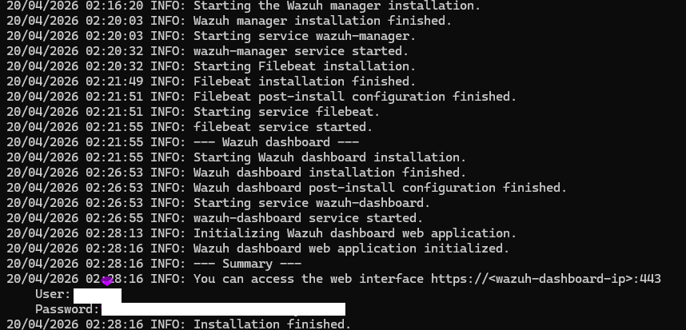
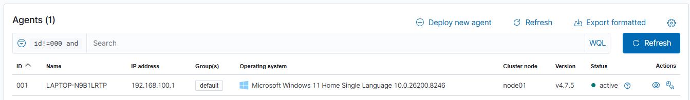
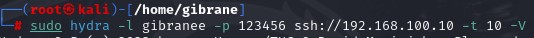
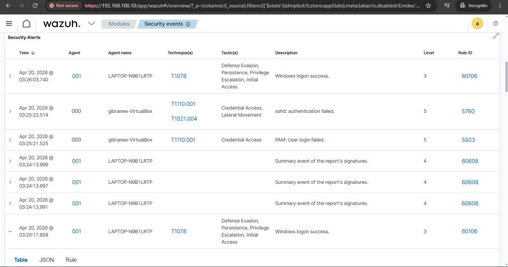

# 🛡️ Wazuh SIEM & SOC Automation Lab Implementation

## 📝 Project Overview
Proyek ini mendemonstrasikan implementasi **Wazuh SIEM** tingkat enterprise untuk monitoring keamanan terpusat. Fokus utama lab ini adalah mengoptimalkan kinerja SIEM pada perangkat dengan *low-resource* serta memvalidasi deteksi ancaman nyata menggunakan kerangka kerja **MITRE ATT&CK**.

---

## 🏗️ Lab Environment & Infrastructure
Lingkungan lab dibangun menggunakan virtualisasi terisolasi untuk simulasi serangan yang aman:

| Component | Operating System | Role | Specifications |
| :--- | :--- | :--- | :--- |
| **SIEM Manager** | Ubuntu Server 22.04 LTS | Central Log Analysis | RAM 2GB + 5GB Swap |
| **Endpoint Client** | Windows 11 Pro | Victim Machine | Wazuh Agent Installed |
| **Attacker Node** | Kali Linux 2024.1 | Threat Actor | Hydra, Nmap, Metasploit |

---

## 🛠️ Implementation Steps

### 1. Wazuh Manager Deployment (Server Side)
Langkah awal adalah instalasi manager. Karena keterbatasan RAM, dilakukan optimasi melalui bypass hardware check:

```bash
curl -sO https://packages.wazuh.com/4.7/wazuh-install.sh
sudo bash wazuh-install.sh -a -i
```
---

### Installation Result

`

## 2. Endpoint Configuration (Windows Agent Connection)

Setelah **Wazuh Manager** berhasil diinstal, langkah berikutnya adalah menghubungkan endpoint Windows ke server agar log keamanan dapat dikirim dan dianalisis oleh Wazuh SIEM.

### Installation Process

1. Unduh **Wazuh Agent installer (.msi)** dari dashboard Wazuh.
2. Jalankan installer tersebut pada mesin Windows.
3. Masukkan IP Address dari **Wazuh Manager** berikut:


Selesaikan proses instalasi hingga agent berhasil terpasang.
Start Wazuh Agent Service

Buka PowerShell sebagai Administrator, kemudian jalankan perintah berikut untuk mengaktifkan service Wazuh Agent.
```bash
NET START Wazuh
```
Perintah ini akan memulai service agent sehingga endpoint Windows mulai mengirimkan log keamanan ke server Wazuh.

Verification Result

Setelah agent aktif, buka Dashboard Wazuh → Agents untuk memastikan endpoint telah berhasil terhubung.

Indikator keberhasilan:

Nama komputer Windows muncul pada daftar agent
Status agent menunjukkan Active (warna hijau)

Screenshot hasil koneksi agent:
`

## 3. Attack Simulation (SSH Brute Force)

Tahap ini bertujuan untuk memvalidasi bahwa sistem **Wazuh SIEM** mampu mendeteksi aktivitas serangan secara real-time.

### Attack Scenario

Simulasi serangan dilakukan dari mesin **Kali Linux** menggunakan tool brute-force **Hydra** untuk mencoba melakukan login ke layanan **SSH** pada target dengan kredensial yang salah secara berulang.

Target pada skenario ini adalah server yang menjalankan **Wazuh Manager**.

### Command Execution

Jalankan perintah berikut pada terminal Kali Linux:

```bash
hydra -l username -p 123456 ip_address -t 10 -V
```

Contoh penggunaan:

```bash
hydra -l root -p 123456 192.168.100.10 -t 10 -V
```

### Penjelasan Parameter

- `-l username` → menentukan username yang akan dicoba untuk login  
- `-p 123456` → password yang digunakan dalam percobaan login  
- `ip_address` → alamat IP target server  
- `-t 10` → menjalankan **10 parallel threads** untuk mempercepat proses brute force  
- `-V` → menampilkan setiap percobaan login secara detail di terminal

### Attack Result

Selama proses brute force berlangsung, Hydra akan mencoba melakukan login berkali-kali menggunakan kredensial yang telah ditentukan.

Terminal Kali Linux akan menampilkan banyak percobaan login yang gagal (**login failed**), yang kemudian akan tercatat oleh sistem monitoring pada **Wazuh SIEM**.

Screenshot berikut menunjukkan proses brute force yang sedang berjalan pada terminal Kali Linux.



## 4. Detection Analysis in Security Events Dashboard

Setelah simulasi serangan brute force dilakukan, langkah berikutnya adalah menganalisis log keamanan yang dikumpulkan oleh Wazuh melalui dashboard monitoring.

Tahap ini merepresentasikan aktivitas **Security Operations Center (SOC)** dalam melakukan investigasi terhadap aktivitas mencurigakan yang terjadi di sistem.

### Investigation Process

1. Login ke **Wazuh Dashboard** melalui browser.
2. Buka menu :Modules → Security Events
3. 
3. Periksa tabel **Security Alerts** untuk menemukan aktivitas yang mencurigakan.

Pada skenario ini, hasil brute force attack akan menghasilkan alert seperti:

- `sshd: authentication failed`
- `PAM: User login failed`

Alert ini biasanya memiliki **Level 5 atau lebih tinggi**, yang menandakan adanya aktivitas login gagal berulang kali.

### MITRE ATT&CK Mapping

Wazuh juga secara otomatis memetakan aktivitas tersebut ke framework **MITRE ATT&CK**.

Contoh teknik yang terdeteksi: T110 Brute Force

Teknik ini termasuk dalam kategori **Credential Access**, yang menunjukkan adanya upaya memperoleh akses dengan menebak kredensial.

### Detection Result

Berikut adalah contoh alert yang dihasilkan oleh sistem setelah serangan brute force dilakukan.



Alert pada tabel menunjukkan:

- Event `sshd: authentication failed`
- Mapping ke teknik MITRE ATT&CK
- Level alert keamanan
- Informasi agent yang terlibat


